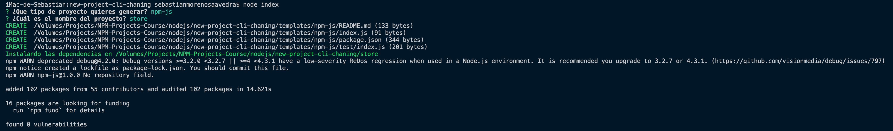

# Generador de proyectos NPM

Este generador sirve para crear projectos NPM de javascript y Typescript.

# Requerimientos
* Node v12.18.2
* NPM >= 6.0.0

## Instalación

```
npm install -g new-project-generator-chaning
```

## Uso

Ejecutamos esta orden

```
npm-cli-project-creator
```

## Log



## Autor

El autor es *[Sebastián Moreno Saavedra](https://github.com/Sebastian197)*

## License

[MIT](LICENSE)

